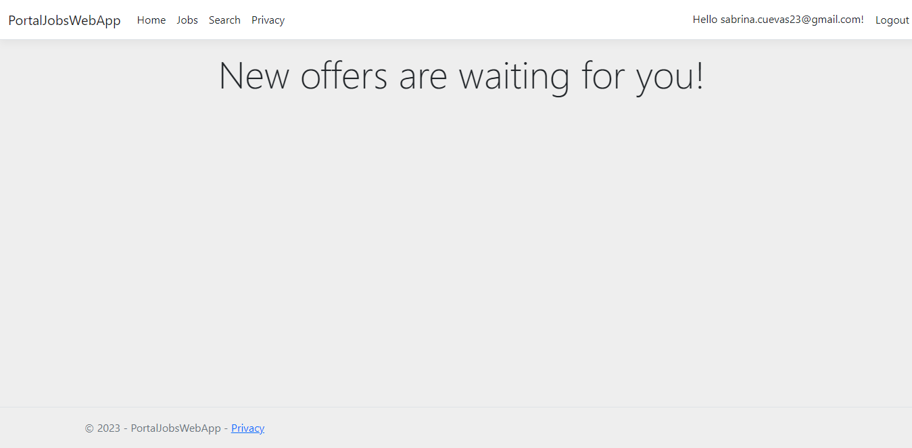
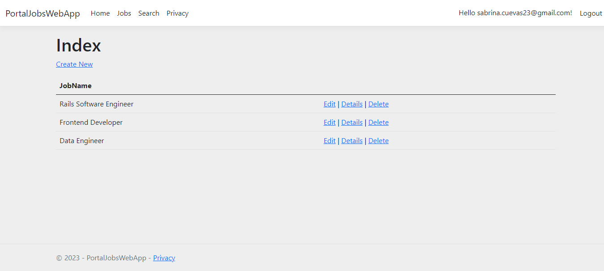
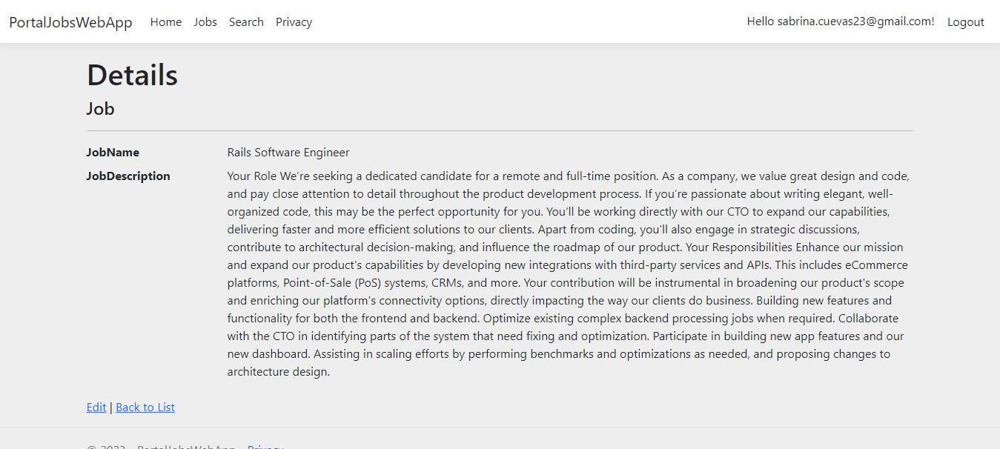

# PortalJobs
It is a very simple app that shows a CRUD of job opportunities.

Concepts applied:
- Use the MVC (Model View Controller) design pattern.
- Configure database tables using the Entity framework.
- Setup of classes as models. Customize Razor forms.
- Create methods inside a controller.
- Style an ASP.NET page with CSS.
- Create a search function to filter database results.

# Screenshots

